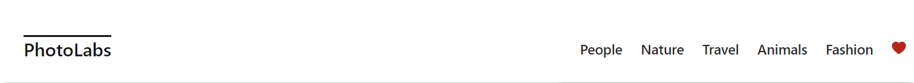

# react-photolabs

The PhotoLabs project, developed as part of the Web Development React course, showcases practical application of React concepts in building an interactive and dynamic web application for photo management and exploration. Through this project, learners gain hands-on experience in creating responsive user interfaces, managing state, and integrating various React libraries.

# Photolabs
The initial landing page of Photolabs, providing a glimpse of its user-friendly interface.

The top navigation bar, offering easy access to key features and topics within the Photolabs application.

Photolabs displaying a notification

A Modal window within Photolabs when user click a photo

Display similar photos or related topics within a modal

Animals Topic

Nature Topic

Travel Topic

People Topic

Fashion Topic


## Setup

To run this project locally, follow these steps:
1. Clone the repository:
   ```sh
   git clone https://github.com/reynaroma/photolabs-starter.git
   ```
2. Navigate to the project directory:
```sh
cd your-repo-name
```
3. Install dependencies with `npm install` in each respective `/frontend` and `/backend`.
```sh
  npm install
```

## [Frontend] Running Webpack Development Server

```sh
cd frontend
npm start
```

## [Backend] Running Backend Servier

Read `backend/readme` for further setup details.

```sh
cd backend
npm start
```
